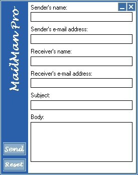

## An Email/AnonyMail Program Like No Other,  Amazing GUI \!

### Description

Send an Email as anyone simply, with no need for an SMTP server. The brilliant user interface makes theis program a 100% must have. Please dont forget to vote!
 
### More Info
 
None - all explained

             |
---                |---
**Submitted On**   |2000-10-14 23:30:10
**By**             |[Gary Mather](https://github.com/Planet-Source-Code/PSCIndex/blob/master/ByAuthor/gary-mather.md)
**Level**          |Intermediate
**User Rating**    |3.2 (163 globes from 51 users)
**Compatibility**  |VB 4\.0 \(32\-bit\), VB 5\.0, VB 6\.0, VB Script, ASP \(Active Server Pages\) 
**Category**       |[Custom Controls/ Forms/  Menus](https://github.com/Planet-Source-Code/PSCIndex/blob/master/ByCategory/custom-controls-forms-menus__1-4.md)
**World**          |[Visual Basic](https://github.com/Planet-Source-Code/PSCIndex/blob/master/ByWorld/visual-basic.md)
**Archive File**   |[CODE\_UPLOAD1065710142000\.zip](https://github.com/Planet-Source-Code/gary-mather-an-email-anonymail-program-like-no-other-amazing-gui__1-12055/archive/master.zip)

